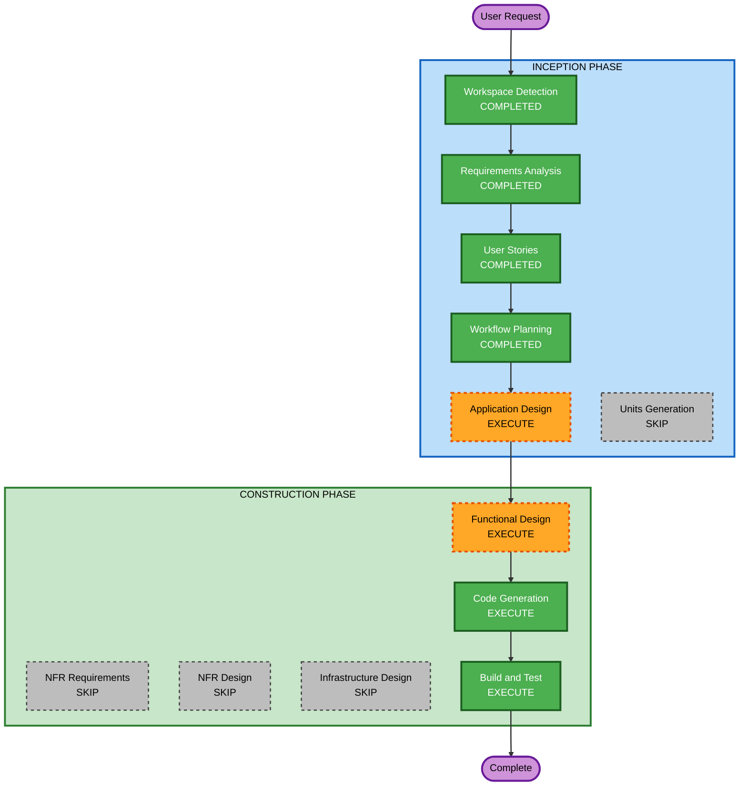

# Execution Plan

## Detailed Analysis Summary

### Project Overview

- **Project Type**: Greenfield (new application)
- **Technology Stack**: Rust + Tauri (macOS desktop)
- **Primary Changes**: Complete new application development

### Change Impact Assessment

- **User-facing changes**: Yes - Entire application is user-facing
- **Structural changes**: Yes - New application architecture
- **Data model changes**: Yes - New data models for tasks, categories, templates
- **API changes**: N/A - Desktop application, no external APIs
- **NFR impact**: Yes - Local storage, theming, performance considerations

### Risk Assessment

- **Risk Level**: Medium
- **Rollback Complexity**: Easy (greenfield, no existing system to break)
- **Testing Complexity**: Moderate (business logic for time merging)

## Workflow Visualization

## Phases to Execute

### INCEPTION PHASE

- [x] Workspace Detection (COMPLETED)
- [x] Requirements Analysis (COMPLETED)
- [x] User Stories (COMPLETED)
- [x] Workflow Planning (COMPLETED)
- [ ] Application Design - EXECUTE
  - **Rationale**: New application needs component identification, service layer design, and data model definition
- [ ] Units Generation - SKIP
  - **Rationale**: Single application, no need for multi-unit decomposition

### CONSTRUCTION PHASE

- [ ] Functional Design - EXECUTE
  - **Rationale**: Time merging business logic requires detailed design (distribution algorithms, category hierarchy handling)
- [ ] NFR Requirements - SKIP
  - **Rationale**: Simple desktop app with straightforward NFRs (local storage, basic theming) - no complex NFR analysis needed
- [ ] NFR Design - SKIP
  - **Rationale**: NFR Requirements skipped, no NFR design needed
- [ ] Infrastructure Design - SKIP
  - **Rationale**: Local desktop application with no cloud infrastructure
- [ ] Code Generation - EXECUTE (ALWAYS)
  - **Rationale**: Implementation of the application
- [ ] Build and Test - EXECUTE (ALWAYS)
  - **Rationale**: Build instructions and test verification

### OPERATIONS PHASE

- [ ] Operations - PLACEHOLDER
  - **Rationale**: Future deployment and monitoring workflows (not applicable for desktop app)

## Estimated Timeline

- **Total Stages to Execute**: 4 (Application Design, Functional Design, Code Generation, Build and Test)
- **Total Stages to Skip**: 5 (Units Generation, NFR Requirements, NFR Design, Infrastructure Design, Operations)

## Success Criteria

- **Primary Goal**: Working macOS desktop application for time tracking with ActiTime integration
- **Key Deliverables**:
  - Rust + Tauri application with time entry (manual + timer)
  - Task classification (direct vs mergeable) with configurable distribution
  - Hierarchical category management
  - Task templates
  - Full view and ActiTime-tuned view
  - YAML local storage with CSV export
- **Quality Gates**:
  - Application builds and runs on macOS
  - Time merging logic correctly distributes time
  - Data persists correctly in YAML format
